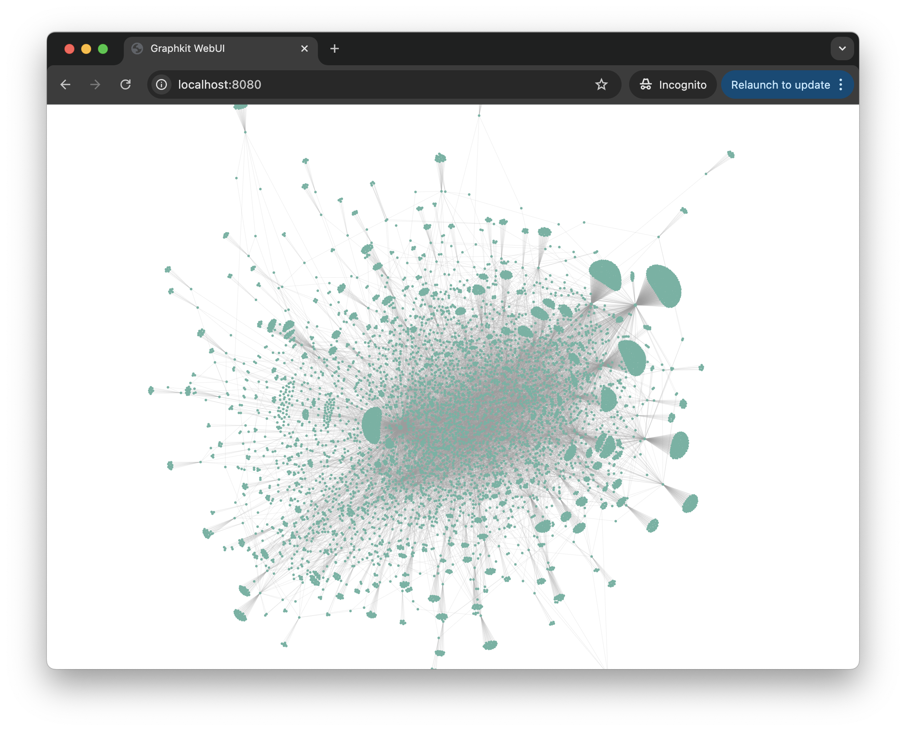

# Graphkit (ALPHA)

Graphkit - the Swiss Army knife of all things graph-related. Graphkit is a simple CLI tool written in Go for processing and analysing graph-based data structures. 

Graphkit is currently in alpha and is still very much under development. If you're interested in using it, feel free, but just expect a few bugs. Feel free to make a pull request to make any corrections and report any issues/suggestions using the issues tracker.

## Features
Currently, Graphkit has two main features: converting and visualising graphs.

### Graph Conversion

Graphkit is the [pandoc](https://pandoc.org/) of graphs. It can be used to convert between different file formats used to store and represent graph structures. 

### Web-Based Visualisation
Thanks to D3.js, Graphkit can be used to produce interactive graphs within the browser. For now, there is no UI. You can inspect graphs with pan-zoom functionality.



## Installation Instructions

For now, you can only install Graphkit from source online. Graphkit is written in Go, so it's relatively easy to build, provided you have it installed prior to downloading.

Currently, you can install Graphkit in one of two ways:

1. With `go install`:

```bash
go install github.com/jamesrashford/graphkit@latest
```

2. Using git:

```bash
git clone https://github.com/jamesrashford/graphkit
cd graphkit
go install
```

Just make sure you have `$GOPATH` added to your main `$PATH` variable.

## Supported Graph Formats

As of this writing, Graphkit supports the following formats:

- `edgelist`: A simple two-column edgelist text file.
- `csv`: A CSV file as a two-column edgelist file.
- `graphology`: A Graphology JSON file.
- `json`: A JSON file in the node-link format.

## CLI Usage and Examples

As mentioned previously, Graphkit can do one of two things: converting between different graph formats (`graphkit convert`) and visualising graphs in the browser (`graphkit web`).

`graphkit convert` usage:

```bash
Usage:
  graphkit convert [flags]

Flags:
      --comments string    The comments character used to indicate which rows are to be ignored (for CSV and edgelist only) (default "#")
      --delimiter string   The delimiter character used to separate values (for CSV only) (default ",")
  -d, --directed           Directed graph
  -h, --help               Help for convert
      --if string          The file format of the input file. Supported file formats include:
                           - 'edgelist': A simple two-column edgelist txt file
                           - 'csv': A CSV file as a two-column edgelist file
                           - 'graphology': A Graphology JSON file
                           - 'json': A JSON file in the node-link format
                           
  -i, --input string       The input file
      --of string          The file format of the output file. Supported file formats include:
                           - 'edgelist': A simple two-column edgelist txt file
                           - 'csv': A CSV file as a two-column edgelist file
                           - 'graphology': A Graphology JSON file
                           - 'json': A JSON file in the node-link format
                           
  -o, --output string      The output file
  -s, --source string      The name of the source column (for CSV only) (default "source")
```

`graphkit web` usage:

```bash
Usage:
  graphkit web [flags]

Flags:
  -a, --addr string        The address and port for the web server (default "0.0.0.0:8080")
      --comments string    The comments character used to indicate which rows are to be ignored (for CSV and edgelist only) (default "#")
      --delimiter string   The delimiter character used to separate values (for CSV only) (default ",")
  -d, --directed           Directed graph
  -f, --format string      The file format of the input file to visualise. Supported file formats include:
                           - 'edgelist': A simple two-column edgelist txt file
                           - 'csv': A CSV file as a two-column edgelist file
                           - 'graphology': A Graphology JSON file
                           - 'json': A JSON file in the node-link format
                           
  -h, --help               Help for web
  -i, --input string       The input file to visualise
  -s, --source string      The name of the source column (for CSV only) (default "source")
  -t, --target string      The name of the target column (for CSV only) (default "target")
```
## CLI Examples:

Converting a directed (using `-d `flag) 'edgelist' graph to 'JSON':

```bash
graphkit convert -i graph.edgelist --if edgelist -o graph.json --of json -d
```

Converting an undirected 'csv' graph to 'graphology':

```bash
graphkit convert -i graph.csv --if csv -o graph.graphology.json --of graphology
```

Visualising a directed 'csv' graph file in the browser:

```bash
graphkit web -i retweets.csv -f csv -d
```

## Future Features

There are many features I would like to include in upcoming releases, but here are just a few of my main priorities. This is what you can expect in the next few releases:

- Support for more graph formats:
    - GEXF, GraphML, GML, etc.
- Improved WebUI:
    - Perform global and local metrics (e.g., degree, community detection, centrality, etc.).
    - Customise graphs (e.g., colours, size, position, labels, etc.).
    - Support for exporting graphs as embeddable HTML files (using iframes) for other websites (e.g., blog posts).
    - Add a data view tab to explore the raw graph (similar to [Gephi](https://gephi.org/)).

## Contact Information

If you'd like to reach out to me, feel free to contact me. I'm active on [Bluesky](https://bsky.app/profile/jrashford.com) and through my [email](mailto:james@jrashford.com). If you have any suggestions or would love to help with the project, do not hesitate to reach out.

